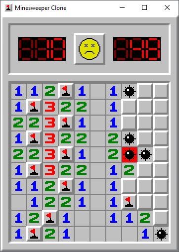

# Minesweeper Clone

This project is an excercise in game development and a way to test the ins and outs of [Godot Engine](https://godotengine.org/).
- The project is fully non-commerical.
- All the scripts are written in GDScript.
- Developed on Godot Engine v3.5.2

## Screenshot

## Credits
### Assets
- [adamgraham](https://github.com/zigurous/unity-minesweeper-tutorial) (Tile Sprites / Game Icon)
- [AJLM97](https://github.com/AJLM97) (Some Sprites)
- [Mariofan9000](https://www.sounds-resource.com/pc_computer/minesweeper/sound/17799/) (Sound Effects)